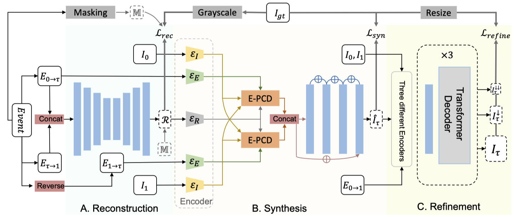

# Video Frame Interpolation via Direct Synthesis with the Event-based Reference

[](https://openaccess.thecvf.com/content/CVPR2024/html/Liu_Video_Frame_Interpolation_via_Direct_Synthesis_with_the_Event-based_Reference_CVPR_2024_paper.html)

## 📌 Overview

This repository provides a PyTorch implementation of our paper: **"Video Frame Interpolation via Direct Synthesis with the Event-based Reference"**, published at **CVPR, 2024**.

We propose **DSER**, an event-based video frame interpolation framework that directly synthesizes intermediate frames using an event-based reference. DSER first reconstructs a reliable event-based reference, aligns bidirectional keyframe features with the event-guided PCD module, and finally refines the prediction using a Transformer decoder. This design avoids explicit optical-flow estimation and improves robustness in occluded and complex-motion regions.

<p align="center">
  
</p>

## 📄 Citation

If you find this work useful for your research, please consider citing:

```bibtex
@inproceedings{liu2024dser,
  title={Video Frame Interpolation via Direct Synthesis with the Event-based Reference},
  author={Liu, Yuhan and Deng, Yongjian and Chen, Hao and Yang, Zhen},
  booktitle={Proceedings of the IEEE/CVF Conference on Computer Vision and Pattern Recognition},
  pages={8477--8487},
  year={2024}
}
```

## 🛠️ Installation

### 1. Environment Setup

We recommend using [Anaconda](https://www.anaconda.com/) to manage the Python environment.

```bash
# Clone the repository
git clone https://github.com/yuhan0802/DSER.git
cd DSER

# Create and activate an environment
conda create -n dser python=3.10
conda activate dser

# Install DSER and all Python dependencies
pip install -e .
```

## 📂 Dataset Preparation

We train and evaluate DSER on the following synthetic and real-world event-based VFI datasets.

| Dataset | Type | Source | Note |
| :--- | :---: | :--- | :--- |
| **Vimeo90K** | Synthetic | [Link](http://toflow.csail.mit.edu/) | Events can be synthesized with [v2e](https://github.com/SensorsINI/v2e) |
| **GOPRO** | Synthetic | [Link](https://seungjunnah.github.io/Datasets/gopro) | Events can be synthesized with [v2e](https://github.com/SensorsINI/v2e) |
| **SNU-FILM** | Synthetic | [Link](https://github.com/myungsub/CAIN) | Events can be synthesized with [v2e](https://github.com/SensorsINI/v2e) |
| **HQF** | Real | [Link](https://arxiv.org/abs/2003.09078) | Real event-camera dataset |
| **HSERGB** | Real | [Link](https://github.com/r00tman/HSERGB) | Real event-camera dataset |
| **BSERGB** | Real | [Link](https://github.com/uzh-rpg/timelens-pp/?tab=readme-ov-file) | Real event-camera dataset |

## 🚀 Usage

### Evaluation

`dser-evaluate` evaluates scene folders containing consecutive image frames and one NPZ event file per inter-frame interval. Configure `EVAL_ROOT` and `CHECKPOINT`, then run:

```bash
export EVAL_ROOT=/path/to/evaluation_dataset
export CHECKPOINT=/path/to/checkpoint.pth
bash scripts/eval.sh
```

Use `FRAME_DIR`, `EVENT_DIR`, `INTERVALS`, and `DEVICE` environment variables to override the defaults. Add `--output_dir /path/to/predictions` to save generated frames.

### Training

Set the dataset roots in `scripts/train.sh`, then start training:

```bash
bash scripts/train.sh
```

You can also supply the paths directly:

```bash
dser-train \
  --bsergb_root /path/to/BSERGB/3_TRAINING \
  --gopro_root /path/to/GOPRO \
  --epoch 100 --batch_size 6 --num_worker 4
```

To resume, append `--RESUME --RESUME_EPOCH <epoch>`.

## 🙏 Acknowledgements

We thank the authors of [v2e](https://github.com/SensorsINI/v2e) for the event simulation framework used to construct synthetic event streams.

## 📜 License

This project is licensed under the [Apache License 2.0](LICENSE.txt).
